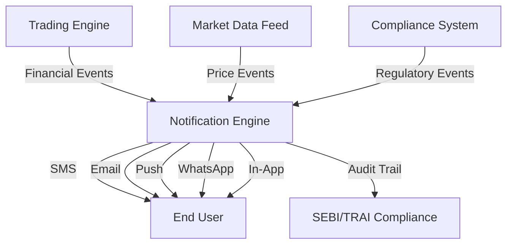
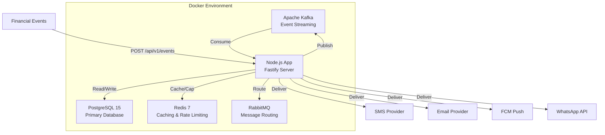
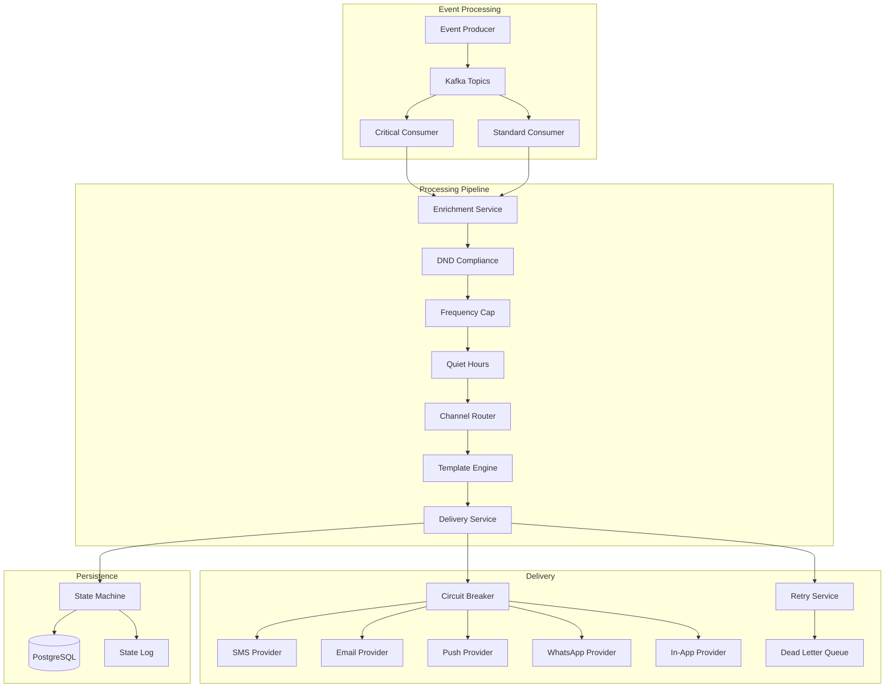
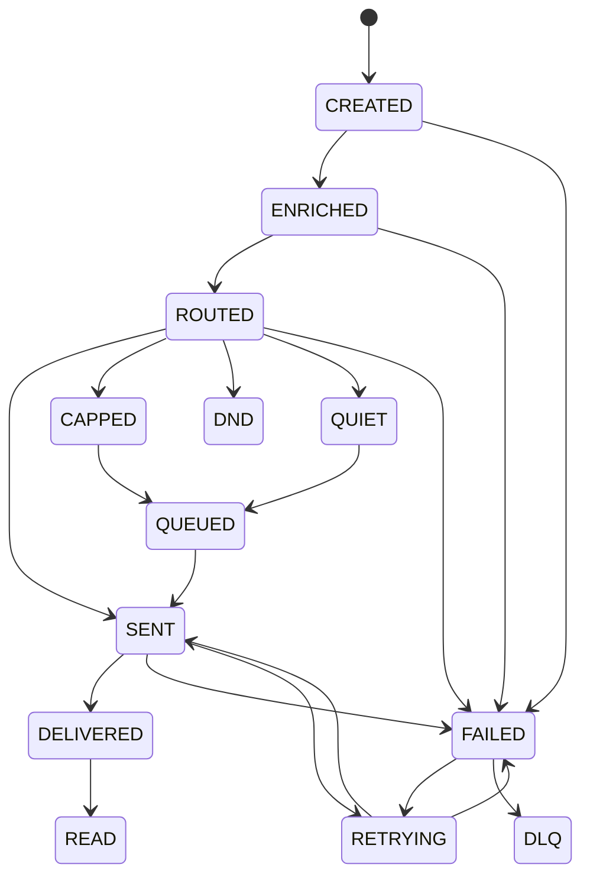
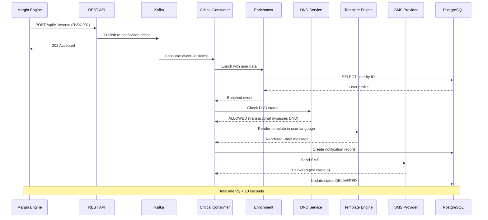
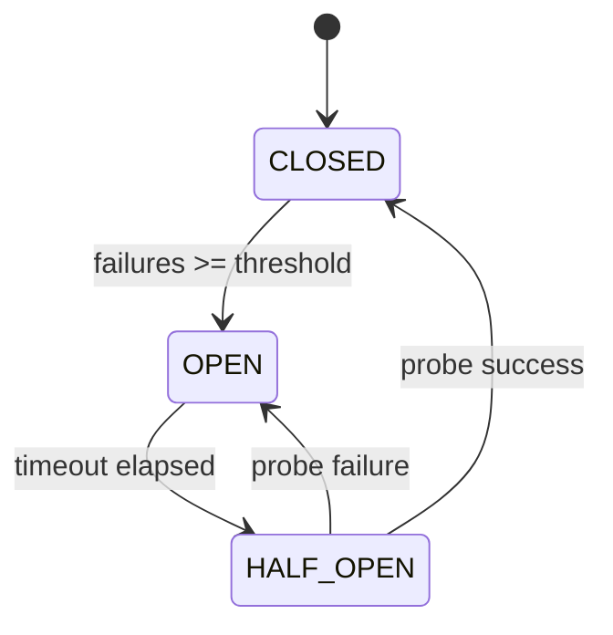
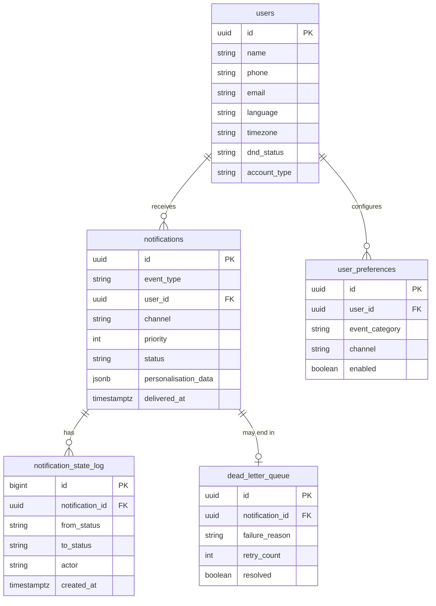

# Architecture Documentation

## System Overview

The BE-6B Notification Engine is built using Event-Driven Architecture (EDA) with a modular monolith approach. The system processes financial events from multiple sources and delivers personalised notifications across 5 channels.

## C4 Architecture Diagrams

### Level 1: System Context

### Level 2: Container Diagram

### Level 3: Component Diagram

## Notification Lifecycle State Machine

## Margin Call Flow (Critical Path)

## Circuit Breaker Pattern

## Database Schema

## Key Architecture Decisions

### ADR-001: Modular Monolith over Microservices
**Decision:** Single Node.js application with clear module boundaries.
**Reason:** 15-day timeline. Microservices would add operational complexity without benefit at this scale. Modules are designed to be extractable into services later.

### ADR-002: Kafka for Event Ingestion
**Decision:** Apache Kafka as the primary event bus.
**Reason:** Handles 1M+ messages/second, provides replay capability, and partition-based parallelism. Critical for handling market crash scenarios with 450K simultaneous events.

### ADR-003: Redis for Frequency Capping
**Decision:** Redis atomic INCR operations for frequency capping.
**Reason:** Sub-millisecond latency, atomic operations prevent race conditions where two workers both think a user has 11 notifications and both send, pushing to 13.

### ADR-004: Circuit Breaker per Provider
**Decision:** Separate circuit breaker instance per delivery provider.
**Reason:** Each provider has different reliability characteristics. A single global circuit breaker would be too coarse-grained.

### ADR-005: Hexagonal Architecture for Templates
**Decision:** Templates defined as configuration, not code.
**Reason:** Adding a new language or event type requires only a new template entry, not a code deployment.